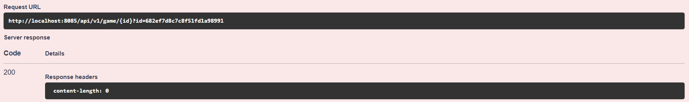

# SpringMongo

## Probas API
### SWAGGER

### POST

### GET

### PUT

### DELETE

## Preguntes

**1.- Afegiu un endpoint que cerqui per un camp de tipus String on feu servir regex. Afegiu el que calgui al servei, repositori, etc.**

Al repositori, creem un mètode per cercar videojocs pel seu nom. Utilitzem l’anotació @Query per definir una consulta personalitzada a MongoDB, on especifiquem com a filtre un regex.

**2.- Què caracteritza una api reactiva com aquesta i què la fa diferent d’una api síncrona amb MVC com les treballades anteriorment?**

Una API reactiva es caracteritza per ser asíncrona i no blocant, i està dissenyada per gestionar grans volums de dades concurrents amb un consum mínim de recursos.

A diferència de les APIs amb MVC, que gestionen cada petició amb un fil dedicat, una API reactiva pot gestionar moltes peticions simultànies amb pocs fils, gràcies a l’ús de programació reactiva amb Mono i Flux.

**3.- Què signifiquen Mono i Flux? Per a què penseu que serveixen i per què són útils en aquest tipus de programació?**

Mono i Flux són tipus de dades reactivament asíncrons. Mono<T> representa una resposta que pot contenir 0 o 1 element, mentre que Flux<T> representa una seqüència de 0 o més elements.

Són útils perquè permeten treballar amb dades de manera no blocant, aplicar operacions en cadena (map, flatMap, etc.), i aprofitar millor els recursos del sistema quan hi ha moltes peticions concurrents.

**4.- Què és record? Un record utilitza getters i setters? Justifiqueu la resposta**

Un record és una classe especial pensada per contenir dades de forma immutable i amb una sintaxi molt reduïda. No utilitza setters perquè els camps són final. Sí que utilitza una forma simplificada de getters, ja que pots accedir a les propietats pel seu nom directament (user.id en comptes de getId()).